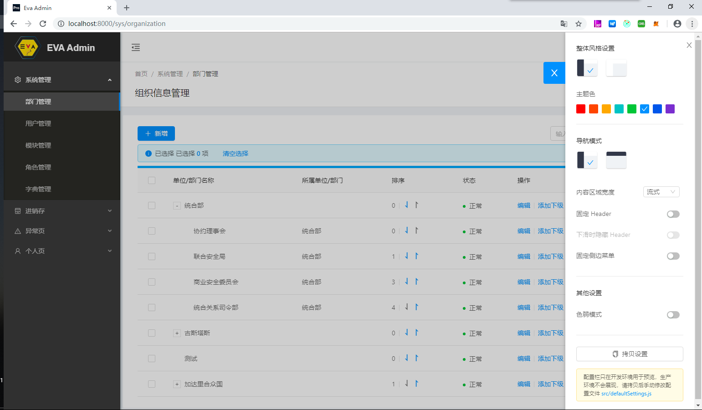

OZAOZA
15653107550

## 运行方式
1.启动后台 `web/../Booter`
```java
run main
```
2.启动前台
```
yarn install
yarn start
```
3.访问`http://localhost`

## 目录说明

+ EVA   
    |-web : 前台UI   
    |-mobile : 手机端工程  
    |-api-web : 单体工程整合层,可将任意api-*工程接入统一发布   
    ------- 服务包 -------
    |-api-core : 核心包-框架核心    
        |-src/main/resources   
            |-db/migration : flyway脚本   
            |-spy.properties : p6spy脚本   
            |-mapper : mybatis sql文件   
            |-i18n : 国际化文件  
            |-logback : 日志配置
            |-mybatis-config : myabtis配置   
    |-api-sys : 基础管理 + 鉴权   
    |-api-jxc : 进销存业务管理   
    ------- 可选增强包 -------
    |-addon-mongo nosql  
    |-addon-pay 支付   
    |-docs : 文档相关   
        |-db : pdm   
        |-doc : 开发文档   
        |-config : 环境配置   
        |-electron : electron打包配置     
        |-generator : mybatis generator    
        
-----------------------------------------------------------------   

 - 连接池: Hikari
 - 配置加密: Jassypt
 - SQL监控: P6SPY
 - 数据库版本管理: Flyway
 - JSON: Fastjson
 - 日志: Logback
 - 工具包: Hutool
 - ORM: Mybatis, Mybatis-plus

 