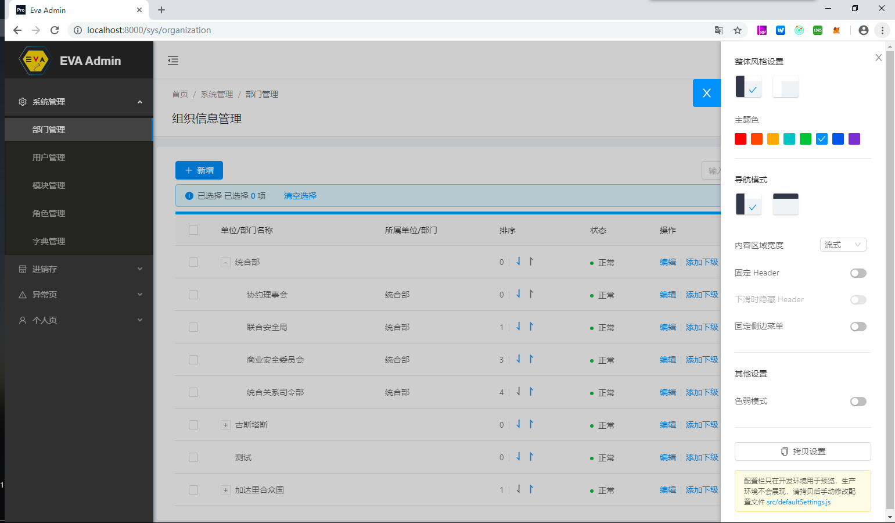

## 运行方式
1.启动后台 `web/../Booter`
```java
run main
```
2.启动前台
```
yarn install
yarn start
```
3.访问`http://localhost`


api("${lib.web}"){
		exclude module: 'spring-boot-starter-tomcat'
	}
"${lib.undertow}",

## 目录说明
-----------------------------------------------------------------   

 - 连接池: Hikari
 - 配置加密: Jassypt
 - SQL监控: P6SPY
 - 数据库版本管理: Flyway
 - JSON: jackson
 - 日志: Logback
 - 工具包: Hutool
 - ORM: Mybatis, Mybatis-plus

 
 